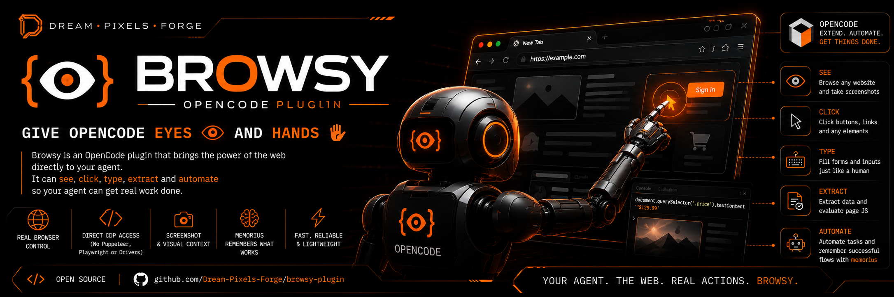

<div align="center">
  
  <h1>browsy</h1>
  <p><strong>Zero-Middleware CDP Browser Automation</strong></p>
  <p>Navigate, screenshot, and evaluate page JS in live Chrome/Chromium tabs via the Chrome DevTools Protocol — no Puppeteer, no Playwright, no drivers. One CDP core, three adapters: an <a href="#install-as-an-opencode-plugin">OpenCode plugin</a>, a universal <a href="#use-with-other-tools">MCP server</a>, and a <a href="#use-with-other-tools">CLI</a>. Learns selectors, quirks, and flows across sessions via <a href="https://github.com/Dream-Pixels-Forge/memorius">memorius</a>.</p>
  <p>
    <a href="https://dream-pixels-forge.github.io/browsy-bot/"><strong>Live site</strong></a> ·
    <a href="https://github.com/Dream-Pixels-Forge/browsy-bot">GitHub</a>
  </p>
  <hr />
</div>

> **OpenCode plugin** — registers `browsy_*` custom tools and an [agent skill](https://opencode.ai/docs/skills/). See [Install as an OpenCode plugin](#install-as-an-opencode-plugin).

## Features

- **Zero middleware** – No ChromeDriver, Puppeteer, or Playwright. Direct CDP WebSocket.
- **Zero hidden state** – Every call receives an explicit `browserUrl` (and optional `targetId`).
- **Granular targeting** – Operate on specific tabs/windows via `targetId`, or auto-discover the first page target.
- **Protocol‑complete** – Full CDP domain wrappers (Page, Runtime, Performance, Accessibility, Target).
- **Multi-tool** – One CDP core, three adapters: an OpenCode plugin, a universal MCP server, and a CLI. The OpenCode plugin registers 8 `browsy_*` tools (`navigate`, `screenshot`, `evaluate`, `recall`, `wait`, `console`, `network_log`, `list_tabs`); the MCP server exposes the same 8 plus `browsy_new_tab` (9 total); the CLI ships the full command set.
- **Learns across sessions** – Optional memorius integration stores browser-automation learnings (selectors, page quirks, navigation flows) and surfaces them before future tasks.
- **Agent skill** – Bundled tool-agnostic `browsy` skill; the OpenCode plugin installs it to `~/.config/opencode/skills/` (disable with `"installSkill": false`), and it also works in Claude Code / Hermes / any agent skill dir.
- **Self-service lifecycle** – `doctor` probes the endpoint, browser binary, and memorius with actionable suggestions; `ensure-browser`/`stop-browser` start and stop a dedicated CDP browser (scoped profile dir, never your real one).
- **Structured extraction** – `extract` pulls typed records (text / html / value / attrs) from matching elements in a single in-page script, no bespoke `evaluate` boilerplate.
- **Trusted input** – `click`/`fill` accept `--trusted` to dispatch renderer-trusted CDP input events (`Input.dispatchMouseEvent` / `Input.insertText`) instead of JS-dispatched ones, so the page sees a real user event.

## Install as an OpenCode plugin

OpenCode auto-loads plugins from your config's `"plugin"` array at startup using Bun. There are three install paths:

### Path 1 — From npm (once published)

```json
{
  "$schema": "https://opencode.ai/config.json",
  "plugin": ["browsy-bot"]
}
```

OpenCode runs `bun install` at startup and caches the package in `~/.cache/opencode/node_modules/`. The published tarball ships the built `dist/` (via `prepublishOnly`), which both Bun and Node execute directly — **no build step on the consumer side**.

### Path 2 — From GitHub (works now)

Bun resolves git specs, so you can install directly from GitHub before an npm publish:

```json
{
  "$schema": "https://opencode.ai/config.json",
  "plugin": ["github:Dream-Pixels-Forge/browsy-bot"]
}
```

### Path 3 — Local plugin directory

Clone the repo into your plugins folder and OpenCode auto-loads it on startup:

```bash
# Global (all projects)
git clone https://github.com/Dream-Pixels-Forge/browsy-bot.git \
  ~/.config/opencode/plugins/browsy-bot

# Or project-level
git clone https://github.com/Dream-Pixels-Forge/browsy-bot.git \
  .opencode/plugins/browsy-bot
```

Local plugins are loaded directly — the dependencies in `package.json` are installed automatically by OpenCode at startup via `bun install`.

### Passing options

All three paths accept plugin options as a `[name, options]` tuple:

```json
{
  "$schema": "https://opencode.ai/config.json",
  "plugin": [
    ["github:Dream-Pixels-Forge/browsy-bot", {
      "url": "ws://localhost:9222",
      "remember": true
    }]
  ]
}
```

Options:

| Option           | Env var            | Default               | Description                                                        |
| ---------------- | ------------------ | --------------------- | ------------------------------------------------------------------ |
| `url`            | `BROWSY_URL`       | `ws://localhost:9222` | Chrome DevTools WebSocket endpoint.                                |
| `targetId`       | `BROWSY_TARGET_ID` | _(none)_              | Default tab to operate on.                                         |
| `remember`       | `BROWSY_REMEMBER`  | `false`               | Store a learning to memorius after each successful browsy call.    |
| `memoriusVault`  | —                  | `main`                | Memorius vault name.                                               |
| `memoriusShelf`  | —                  | `browsy`              | Memorius shelf for browsy learnings.                               |
| `installSkill`   | —                  | `true`                | Auto-install the bundled `browsy` skill to the user's skills dir.  |

### Prerequisites

Get a CDP endpoint up on `ws://localhost:9222`. Two options:

**Self-service (recommended)** — let browsy launch a dedicated headless
browser for you (dedicated profile dir, never your logged-in one):

```bash
browsy ensure-browser     # starts Chrome on 9222 if nothing is listening
```

**Manual** — launch your own Chrome/Chromium with remote debugging:

```bash
chromium --remote-debugging-port=9222 --headless --no-sandbox
```

The default endpoint is `ws://localhost:9222`. Override with the plugin's `"url"` option or the `BROWSY_URL` environment variable. Use `browsy doctor` to check whether the endpoint, a browser binary, and memorius are all reachable before a task, and `browsy stop-browser` to shut down a browser `ensure-browser` started.

### Registered tools

Once loaded, the agent has access to these custom tools:

| Tool                | Description                                                              |
| ------------------- | ------------------------------------------------------------------------ |
| `browsy_navigate`   | Navigate a CDP-connected tab to a URL.                                    |
| `browsy_screenshot` | Capture a screenshot; returns base64 PNG or writes to `outputPath`.      |
| `browsy_evaluate`   | Evaluate a JavaScript expression in the page context.                    |
| `browsy_recall`     | Search past browser-automation learnings from the memorius vault.        |
| `browsy_wait`       | Wait for a selector to appear (with timeout / polling interval).        |
| `browsy_console`    | Dump captured console messages for the current tab.                     |
| `browsy_network_log`| Dump captured network requests for the current tab.                     |
| `browsy_list_tabs`  | List open CDP targets (tabs/windows) with their ids.                   |

### Memorius learning

When `"remember": true` (or `BROWSY_REMEMBER=1`), every successful `browsy_*`
tool call stores a compact learning to memorius under the `"browsy"` shelf.
Use the `browsy_recall` tool before a browser task to surface relevant past
learnings (selectors that worked, page-specific quirks, navigation flows).

Memorius is **optional** — if the `memorius` CLI is not installed, browsy
works normally and `browsy_recall` returns an empty result. To enable native
memorius agent tools as well, add it as an [MCP server](https://opencode.ai/docs/mcp-servers/):

```json
{
  "mcp": {
    "memorius": { "type": "local", "command": ["memorius", "serve"] }
  }
}
```

### Agent skill

The plugin bundles a `browsy` agent skill (`skills/browsy/SKILL.md`). On
init, it is copied to `~/.config/opencode/skills/browsy/SKILL.md` so
opencode's `skill` tool can discover and load it. Disable this with
`"installSkill": false`.

## Use with other tools

The OpenCode plugin is just one of three adapters over the same CDP core.
The other two are universal:

- **MCP server** — works with any MCP client: Claude Code, Cursor,
  Gemini CLI, Cline, Continue, Zed, Hermes, and (yes) OpenCode's own MCP
  support. One config line and the full `browsy_*` toolset is available.
- **CLI** — any agent with a terminal can shell out to `browsy`.
  `--json` gives a stable machine-readable contract.
- **Standalone library** — `import { createBrowsy } from "browsy-bot"`.

### MCP server (universal)

The server runs under Node and speaks MCP over stdio. Register it in
your client:

**Claude Code** (`.mcp.json` or `claude mcp add`):

```json
{
  "mcpServers": {
    "browsy": {
      "command": "npx",
      "args": ["tsx", "/path/to/browsy-bot/src/mcp.ts"]
    }
  }
}
```

**Cursor / any client that takes a command+args**:

```json
{
  "command": "node",
  "args": ["/path/to/browsy-bot/dist/mcp.js"]
}
```

**Hermes** (`config.yaml` `mcp.servers`):

```yaml
mcp:
  servers:
    browsy:
      type: local
      command:
        - npx
        - tsx
        - /path/to/browsy-bot/src/mcp.ts
```

Environment: `BROWSY_URL` sets the CDP endpoint (default
`ws://localhost:9222`); `BROWSY_MEMORIUS_VAULT` / `BROWSY_MEMORIUS_SHELF`
tune the optional memorius learning.

Tools exposed: `browsy_navigate`, `browsy_new_tab`, `browsy_list_tabs`,
`browsy_screenshot`, `browsy_evaluate`, `browsy_wait`, `browsy_console`,
`browsy_network_log`, `browsy_recall`.

### CLI (universal fallback)

```bash
# One-shot install
npm i -g browsy-bot            # or: npx tsx /path/to/browsy-bot/src/cli.ts

# Addressing: -u/--url (CDP endpoint) and -t/--target (tab id). -j/--json
# switches every command to machine-readable output.
browsy navigate https://example.com -j
browsy open https://example.com -j      # alias of navigate (bring to front)
browsy screenshot --full -o out.png
browsy eval "document.title"
browsy wait ".loaded" --timeout 5000
browsy click ".save"
browsy click ".save" --trusted        # renderer-trusted CDP mouse event
browsy fill "#email" "a@b.c"
browsy fill "#email" "a@b.c" --trusted  # trusted type-in via Input.insertText
browsy extract "article.card" text "attr:src" value   # structured records
browsy extract "li" text --limit 20
browsy doctor                          # diagnostics + actionable suggestions
browsy ensure-browser [--port N] [--binary PATH] [--no-headless]
browsy stop-browser [--port N]
browsy page-text
browsy console            # captured JS console entries
browsy network           # captured network requests
browsy tabs              # list open tabs
browsy new-tab https://x.test
browsy close-tab <id>
browsy mcp               # run the MCP stdio server
```

**Browser lifecycle.** `ensure-browser` probes the CDP endpoint; if it's
down it spawns a Chrome/Chromium on a *dedicated* `user-data-dir` under
the browsy state dir (`$BROWSY_STATE_DIR` or `~/.browsy`), writes a
pidfile, and polls `/json/version` until the endpoint answers. It
never touches your real, logged-in Chrome profile. `stop-browser`
SIGTERMs the recorded pid and clears the pidfile. `doctor` is read-only
and reports endpoint reachability, binary discovery, and memorius
availability with next-step suggestions — run it first when nothing
works.

Exit codes: `0` success, `1` runtime/CDP-operation failure, `2` usage
error, `3` CDP connection failure.

## API (standalone library)

```ts
import { createBrowsy } from "browsy-bot";

// Create a Browsy instance
const browsy = createBrowsy("ws://localhost:9222");

await browsy.connect(); // Connect to Chrome DevTools Protocol
try {
  // Domains are available after connect() (they throw otherwise).
  await browsy.page.navigate({ url: "https://example.com" });
  const screenshot = await browsy.page.captureScreenshot({ format: "png" });
  const title = await browsy.runtime.evaluate({ expression: "document.title" });
} finally {
  await browsy.close(); // Always clean up
}
```

### `createBrowsy(browserUrl: string, targetId?: string): Browsy`

Factory function to create a Browsy instance.

### `Browsy` class

| Member          | Type                  | Description                                                                      |
| --------------- | --------------------- | -------------------------------------------------------------------------------- |
| `connect()`     | `Promise<void>`       | Opens a CDP WebSocket connection to `browserUrl`/`targetId` and initializes domains. |
| `close()`       | `Promise<void>`       | Closes the CDP connection.                                                       |
| `isConnected`   | `boolean`             | True if a live CDP connection exists.                                            |
| `getStatus()`   | `ConnectionStatus`    | Current connection state (`disconnected`, `connecting`, `connected`, `closed`). |
| `page`          | `PageDomain`          | Page‑related CDP commands (navigate, screenshot, reload, etc.). **Throws if not connected.** |
| `runtime`       | `RuntimeDomain`       | Runtime‑related CDP commands (evaluate, releaseObjectGroup). **Throws if not connected.**      |
| `performance`   | `PerformanceDomain`   | Performance‑related CDP commands (getMetrics, enable/disable). **Throws if not connected.**   |
| `accessibility` | `AccessibilityDomain` | Accessibility‑related CDP commands (getFullAXTree). **Throws if not connected.**               |
| `target`        | `TargetDomain`        | Target‑related CDP commands (getTargets). **Throws if not connected.**                     |

### Convenience Functions

Five groups:

**One-shot CDP helpers** — each opens a throwaway connection:

```ts
import { navigate, captureScreenshot, evaluate } from "browsy-bot";

// Navigate
await navigate("ws://localhost:9222", "https://example.com");

// Screenshot (returns base64 PNG string)
const imgBase64 = await captureScreenshot("ws://localhost:9222", { format: "png" });

// Evaluate JavaScript (returnByValue: true by default)
const pageTitle = await evaluate("ws://localhost:9222", "document.title");
```

**Session actions** — cached CDP sockets keyed by `(browserUrl, targetId)`;
console/network events accumulate between calls. Use when you need a
multi-step flow without paying a handshake per call:

```ts
import {
  getSession,
  click, fill, waitForSelector,
  pageText, pageTitle, currentUrl,
  screenshot, fullPageScreenshot,
  navigatePage, listTabs, newTab, closeTab,
  dropSession, closeAllSessions,
} from "browsy-bot";

const session = await getSession("ws://localhost:9222", { targetId: "ABC123" });
await navigatePage(session, "https://example.com");
await waitForSelector(session, ".card", { timeoutMs: 5000 });
await click(session, ".save");
await fill(session, "#email", "a@b.c");
console.log(await pageText(session));
await dropSession("ws://localhost:9222", "ABC123"); // or closeAllSessions()
```

| Function | Signature | Returns |
| -------- | --------- | ------- |
| `click` | `(session, selector: string, options?: { trusted?: boolean })` | `Promise<boolean>` — true if a match was clicked. Pass `{ trusted: true }` to dispatch a renderer-trusted CDP mouse event (`Input.dispatchMouseEvent`) instead of JS dispatch. |
| `fill` | `(session, selector: string, value: string, options?: { trusted?: boolean })` | `Promise<boolean>` — true if a match was filled. Pass `{ trusted: true }` to focus the control then type via `Input.insertText`. |
| `waitForSelector` | `(session, selector: string, options?: { timeoutMs?: number; intervalMs?: number })` | `Promise<void>` |
| `pageText` | `(session)` | `Promise<string>` — visible text |
| `pageTitle` | `(session)` | `Promise<string>` |
| `currentUrl` | `(session)` | `Promise<string>` |
| `screenshot` | `(session, options?: { format?: 'png'|'jpeg'; quality?: number })` | `Promise<string>` — base64 |
| `fullPageScreenshot` | same options | `Promise<string>` — base64 |
| `navigatePage` | `(session, url: string)` | `Promise<void>` |
| `listTabs` | `(session)` | `Promise<TabInfo[]>` where `TabInfo = { id, url, title?, type }` |
| `newTab` | `(session, url?: string)` | `Promise<string>` — new target id |
| `closeTab` | `(session, targetId: string)` | `Promise<void>` |
| `getSession` | `(browserUrl: string, options?: { targetId?: string; ... })` | `Promise<Session>` |
| `dropSession` | `(browserUrl: string, targetId?: string)` | `void` |
| `closeAllSessions` | `()` | `Promise<void>` |

**Structured extraction** — pull typed records from matching elements in one
in-page script (no bespoke `evaluate` boilerplate):

```ts
import { extract } from "browsy-bot";

const cards = await extract(session, "article.card", [
  "text",
  "attr:src",
  "value",
], { limit: 50 });
// -> Record<string, unknown>[] : one object per matched element
```

Field specs: `"text"` → `innerText`, `"html"` → `innerHTML`,
`"textContent"` → trimmed `textContent`, `"value"` → `value`, or
`"attr:<name>"` → `getAttribute(<name>)` (keyed by `<name>`).

**Diagnostics** — `doctor` returns a structured `DoctorReport` (endpoint
reachability + target/page count, binary discovery, memorius availability,
actionable suggestions). All probes are injectable so unit tests run
network-free. The individual probes are exported too:

```ts
import { doctor, probeVersion, findBrowserBinary, checkMemorius } from "browsy-bot";

const report = await doctor("ws://localhost:9222");
console.log(report.ready, report.suggestions);
```

| Function | Signature | Returns |
| -------- | --------- | ------- |
| `doctor` | `(browserUrl: string, options?: DoctorOptions)` | `Promise<DoctorReport>` |
| `probeVersion` | `(browserUrl: string)` | `Promise<CDPBrowserInfo>` |
| `findBrowserBinary` | `(explicit?: string)` | `string \| undefined` |
| `checkMemorius` | `(shell?: (cmd) => Promise<{ ok: boolean; error?: string }>)` | `Promise<MemoriusProbe>` — default shell runs `memorius --version` |

**Browser lifecycle** — start/stop a dedicated CDP browser. `ensureBrowser`
probes the endpoint first and only launches (detached, dedicated
`user-data-dir`, pidfile, `/json/version` poll) if it's down.
`buildBrowserArgs` is pure/testable; the launched browser never touches your
default logged-in profile:

```ts
import { ensureBrowser, stopBrowser } from "browsy-bot";

const { browserUrl, handle } = await ensureBrowser({ port: 9222 });
// ... drive the browser ...
await stopBrowser({ port: 9222 }); // SIGTERMs the recorded pid
```

| Function | Signature | Returns |
| -------- | --------- | ------- |
| `ensureBrowser` | `(options?: BrowserOptions)` | `Promise<EnsuredBrowser>` — `{ launched, browserUrl, handle? }` |
| `launchBrowser` | `(options?: BrowserOptions)` | `Promise<LaunchedBrowser>` |
| `stopBrowser` | `(options?: BrowserOptions)` | `StoppedBrowser` — `{ stopped, pid?, reason? }` |
| `buildBrowserArgs` | `(options?: BrowserOptions)` | `string[]` (pure) |
| `resolveBrowserBinary` | `(options?: BrowserOptions)` | `string \| undefined` |
| `waitForReady` | `(browserUrl, timeoutMs, intervalMs?)` | `Promise<void>` |

### URL resolution

`browserUrl` accepts `ws://`, `wss://`, `http://`, `https://`, or a bare `host:port`:

- `http(s)://` is converted to `ws(s)://`.
- When a `targetId` is given, the connection goes to `/devtools/page/<targetId>` (required for `Page` domain commands).
- Without a `targetId`, the connection defaults to `/devtools/browser`.

## CDP Domain Wrappers

Each domain exposes strongly‑typed methods matching the CDP specification.

### PageDomain

| Method                                                | Parameters                                                                                                                                                                 | Returns                                                                                          |
| ----------------------------------------------------- | -------------------------------------------------------------------------------------------------------------------------------------------------------------------------- | ----------------------------------------------------------------------------------------------- |
| `navigate(params)`                                    | `{ url: string; referrer?: string; transitionType?: string; frameId?: string }`                                                                                          | `{ frameId: string; loaderId: string; errorText?: string }`                                     |
| `captureScreenshot(params?)`                          | `{ format?: 'png'\|'jpeg'; quality?: number; clip?: {x,y,width,height,scale?}; fromSurface?: boolean }`                                                                   | `{ data: string }` (base64‑encoded image)                                                       |
| `reload(params?)`                                     | `{ hard?: boolean; ignoreCache?: boolean }`                                                                                                                                | `void`                                                                                          |
| `bringToFront()`                                      | —                                                                                                                                                                          | `void`                                                                                          |
| `getLayoutMetrics()`                                  | —                                                                                                                                                                          | `{ contentSize, visibleSize, layoutSize, visualViewport }`                                       |

### RuntimeDomain

| Method                      | Parameters                  | Returns                              |
| --------------------------- | --------------------------- | ------------------------------------ |
| `evaluate(params)`          | `Runtime.EvaluateParams`    | `Runtime.EvaluateResult`             |
| `releaseObjectGroup(params)`| `{ objectGroup: string }`   | `void`                               |

### PerformanceDomain

| Method         | Parameters | Returns                                            |
| -------------- | ---------- | -------------------------------------------------- |
| `enable()`     | —          | `void`                                             |
| `disable()`    | —          | `void`                                             |
| `getMetrics()` | —          | `{ metrics: Array<{ name: string; value: number }> }` |

### AccessibilityDomain

| Method            | Parameters | Returns                                         |
| ----------------- | ---------- | ----------------------------------------------- |
| `getFullAXTree()` | —          | `{ nodes: AXNode[] }` (full accessibility tree) |

### TargetDomain

| Method | Parameters | Returns |
| ------ | ---------- | ------- |
| `getTargets()` | — | `Target.GetTargetsResult` (all open CDP targets) |
| `createTarget(params)` | `{ url?: string }` | `Target.CreateTargetResult` — new target id |
| `closeTarget(params)` | `{ targetId: string }` | `Target.CloseTargetResult` |

> `createTarget` / `closeTarget` require a **browser-level** connection
> (no `targetId`); use a session opened without a target for tab
> management.

## Development

### Prerequisites

- Node.js ≥ 18
- TypeScript
- A Chrome/Chromium instance launched with remote debugging:
  ```bash
  chromium --remote-debugging-port=9222 --headless --no-sandbox
  ```

### Build

```bash
npm run build     # compiles src/ to dist/ (ESM)
npm run typecheck # type-check without emitting
npm test         # run the vitest suite
```

### Run Example

```bash
npm run example
```

## How It Works

1. **Connection** – opens a raw WebSocket to the Chrome DevTools endpoint.
2. **Command Dispatch** – each method serializes a CDP message (`{id, method, params}`) and waits for the matching response via message ID correlation. Errors from CDP are **rejected**, not swallowed.
3. **Session cache** – `getSession(browserUrl, options?)` returns a cached, long-lived CDP connection keyed by `(browserUrl, targetId)`. Console and network events accumulate on the session between calls (no per-call handshake churn). `dropSession` / `closeAllSessions` tear it down explicitly.
4. **Event Subscription** – domains and sessions can listen for CDP events via the internal event emitter.
5. **Resource Cleanup** – calling `close()` (or letting a one-shot helper's scope end) tears down the WebSocket; sessions persist until dropped or the process exits.

## Why “Zero Middleware”?

Traditional browser automation layers (Selenium/WebDriver, Puppeteer, Playwright) introduce extra binaries, separate processes, protocol translation layers, and hidden internal state. `browsy-bot` bypasses all of that: you talk **directly** to Chrome’s debugging interface, giving you minimal latency, full fidelity to CDP, and a deterministic resource lifecycle. The one thing it does *not* remove is the CDP endpoint's blast radius — a live endpoint is equivalent to a shell on the host that runs Chrome. See [Security](#security).

## Use Cases

- **Live UI Validation** – Agents can open a DevTools tab, navigate, and assert visual/regression state.
- **Bug Reproduction** – From an issue URL, automatically open the page, fill forms, capture console errors.
- **Performance Budgets** – Collect metrics via `Performance.getMetrics()` before allowing a merge.
- **Documentation Generation** – Walk a wizard UI, capture screenshots per step, auto‑generate markdown guides.
- **Accessibility Auditing** – Pull the full AXTree and verify ARIA roles, names, and states.
- **Data Extraction** – Use the first-class `extract` primitive to pull
  typed records (text / html / value / `attr:<name>`) from matching
  elements in one in-page script, or drop to raw `Runtime.evaluate`
  for fully bespoke pulls.

## Security

CDP is not a read-only channel — it grants **full control of the
browser**: arbitrary JavaScript execution, network visibility, file
system access via page downloads, and (in headless mode) the ability to
drive a fully-logged-in browser. Treat the CDP endpoint as
equivalent to a shell on the machine that runs Chrome.

- **Default endpoint is `ws://localhost:9222`.** The CDP port must
  not be exposed beyond the loopback interface. Do not bind
  `--remote-debugging-port` to `0.0.0.0` unless the port is behind
  a firewall and you understand the blast radius.
- **`BROWSY_URL` overrides the endpoint.** Setting it to a non-local
  address (e.g. `ws://10.0.0.5:9222` on a shared dev box) is a
  lateral-movement vector: any process that can set `BROWSY_URL`
  gains CDP control of that Chrome instance. Never set it from
  untrusted input.
- **`browsy_evaluate` runs arbitrary JS in the page context.** This
  is the whole point, but it means a malicious or compromised agent
  can exfiltrate page data, read localStorage/cookies (subject to
  same-origin), and trigger further network requests. Keep
  agent prompts and tool inputs trusted.
- **Memorius learns are persisted to disk.** `browsy_recall`
  surfaces them back to the agent. If the vault lives in a shared
  directory, learned selectors/URLs/flows become information to
  other agents on the host. Use a per-user or per-project vault.
- **Browser launch is opt-in and profile-scoped.** `ensure-browser`
  can start a Chrome/Chromium for you, but only on a *dedicated*
  `user-data-dir` under the browsy state dir — never your default,
  logged-in profile. That keeps the boundary simple: the launched
  browser carries no credentials you care about. If you want a
  logged-in browser, launch it yourself and point `-u` at it; if you
  don't trust the agent, don't.
- **`--trusted` input is still JS-gated.** The trusted click/fill
  path measures an element's rect in the page and dispatches CDP
  input events at that coordinate. A malicious page can still move
  the target between measure and dispatch (TOCTOU); the event is
  "trusted" only in that the page's event listeners see it as a
  user-originated input event, not a synthetic `el.click()`.

## License

MIT © 2026 Dream-Pixels-Forge
